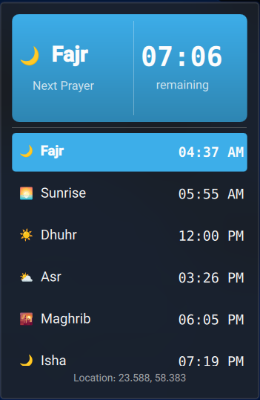

# Prayer Times Plasmoid for KDE Plasma 6


A native KDE Plasma 6 desktop widget that displays Islamic prayer times. It works completely offline, supports automatic location detection via system services or manual coordinate input, and offers a wide range of globally recognized calculation methods.

## ✨ Features

- **Offline Calculation:** Accurately calculates prayer times using the reliable [PrayTime.js](https://praytimes.org/) library.
- **Flexible Location Settings:**
  - Automatic detection via system location services (Recommended).
  - Manual coordinate input (Latitude and Longitude).
- **Multiple Calculation Methods:** Supports over 8 globally recognized methods including:
  - Muslim World League (MWL)
  - Islamic Society of North America (ISNA)
  - Egyptian General Authority of Survey
  - Umm Al-Qura University, Makkah
  - University of Islamic Sciences, Karachi
  - Institute of Geophysics, University of Tehran
  - Shia Ithna-Ashari (Jafari)
  - Custom Angles
- **Juristic Methods:** Choice of Asr prayer method (Standard/Shafi, Maliki, Hanbali or Hanafi).
- **Manual Adjustments:** Fine-tune prayer times with custom offsets (in minutes) and calculation angles.
- **Full Native RTL & Arabic Support:** Complete Arabic localizations and Right-to-Left (RTL) UI layout.
- **Plasma 6 Native:** Designed using Qt 6, QML, and native `PlasmaComponents3` framework elements.

## 📸 Screenshots




## 📦 Installation

### Method 1: Using the Build Script (Recommended)

The easiest way to build, package, and install the plasmoid along with all translations is to use the provided `build.sh` script.

1. Clone the repository:
   ```bash
   git clone https://github.com/zayedalsaidi/org.kde.prayertimes.git
   cd org.kde.prayertimes
   ```

2. Make the script executable and run it:
   ```bash
   chmod +x build.sh
   ./build.sh
   ```
   This script will automatically:
   - Compile all translation files (`.po` → `.mo`).
   - Package the plasmoid into `org.kde.prayertimes-v1.0.1.plasmoid`.
   - Install/upgarde the package and translations to your local system.
   - Rebuild the Plasma cache and restart `plasmashell`.

### Method 2: Using `kpackagetool6` (Manual)

If you prefer not to use the build script, you can install the plasmoid manually without packaging:

1. Clone the repository:
   ```bash
   git clone https://github.com/zayedalsaidi/org.kde.prayertimes.git
   cd org.kde.prayertimes
   ```

2. Install the widget to your local Plasma applet directory:
   ```bash
   kpackagetool6 --type=Plasma/Applet --install .
   ```

3. Rebuild the system cache and restart `plasmashell`:
   ```bash
   kbuildsycoca6 --noincremental
   kquitapp6 plasmashell && kstart plasmashell
   ```

### ️ Upgrading the Plasmoid

To upgrade to the latest version:

1. Pull the latest changes from the repository:
   ```bash
   cd org.kde.prayertimes
   git pull
   ```

2. Run the build script to repackage and reinstall everything:
   ```bash
   ./build.sh
   ```
   
   *Alternatively, if you installed manually:*
   ```bash
   kpackagetool6 --type=Plasma/Applet --upgrade .
   kbuildsycoca6 --noincremental
   kquitapp6 plasmashell && kstart plasmashell
   ```

## 📂 Project Structure

```text
org.kde.prayertimes/
── metadata.json           # Plasma 6 applet metadata & version declarations
├── LICENSE                 # GPL-3.0-or-later license
── README.md               # This file
└── contents/
    ├── config/
    │   ── main.xml        # KConfig settings definitions
    ├── code/
    │   ├── praytime.js     # PrayTime.js library (modified for QML)
    │   └── prayerEngine.js # Calculation engine and logic
    └── ui/
        ├── main.qml        # Core UI and timeline rendering
        └── configGeneral.qml # Settings UI
```

## 🌐 Translation & Building Locales

This plasmoid supports multiple languages. All UI texts are wrapped in `i18n()` to support multi-language translations.

### Contributing a Translation
To contribute a translation for your language (e.g., Arabic `ar`):
1. Create a directory inside the `po/` folder named after your language code (e.g., `po/ar/`).
2. Add your translation file named `plasma_applet_org.kde.prayertimes.po` inside that directory.

### Building Translations Manually
To compile the `.po` files into binary `.mo` files and package the plasmoid with all translations, use the provided build script:

1. Ensure you have the `gettext` package installed (for the `msgfmt` command):
   ```bash
   sudo apt install gettext   # Debian/Ubuntu
   sudo pacman -S gettext     # Arch Linux
   ```

2. Run the build script:
   ```bash
   chmod +x build.sh
   ./build.sh --translations-only
   ```
   This script will:
   - Scan the `po/` directory for all `.po` files.
   - Compile them into `.mo` files inside a `locale/` directory.
   - Install the translations automatically.


## 📚 Acknowledgments

This plasmoid relies on [PrayTime.js](https://praytimes.org/) (v3.2) developed by **Hamid Zarrabi-Zadeh**. The library has been slightly modified to ensure full compatibility with the Qt/QML environment in KDE Plasma 6.

- **Official Website:** https://praytimes.org/
- **Calculation Documentation:** https://praytimes.org/docs/calculation
- **Source Code:** https://github.com/zarrabi/praytime
- **License:** MIT License

##  License

Distributed under the **GPL-3.0-or-later** License. See `LICENSE` for more details.

---

Made with ❤️ for the KDE community and Muslim users worldwide.
